```mermaid
graph TD
    %% Initialisation
    Start((Start)) --> Load["Load Matrix X & Params"]
    Load --> Warmup["Numba JIT Compilation"]
    Warmup --> InitPop["Initialize Population<br/>(SVD-based + Random)"]
    InitPop --> LocalSearchInit["Initial Local Search"]
    
    %% Boucle Principale
    LocalSearchInit --> CheckTime{"Max Time<br/>Reached?"}
    
    %% Fin de boucle
    CheckTime -- Yes --> GoldenPolish["💎 Golden Polish<br/>(5000 Steps LS)"]
    GoldenPolish --> Save["Save Solution & Plot"]
    Save --> End((End))

    %% Logique de Contrôle (Earthquake/Cataclysm)
    CheckTime -- No --> CheckCata{"Earthquake Limit<br/>Reached?"}
    
    %% Cataclysm
    CheckCata -- Yes --> Cataclysm["☠️ CATACLYSM<br/>Reset Population except Best"]
    Cataclysm --> ResetStats["Reset AOS & Stats"]
    ResetStats --> CheckTime
    
    %% Earthquake
    CheckCata -- No --> CheckStag{"Stagnation Limit<br/>Reached?"}
    CheckStag -- Yes --> Earthquake["🌋 EARTHQUAKE<br/>Perturb Best & LS"]
    Earthquake --> Replace["Replace Worst Individual"]
    Replace --> ResetStag["Reset Stagnation Counter"]
    ResetStag --> CheckTime

    %% Reproduction (Si pas d'event majeur)
    CheckStag -- No --> Selection["🧬 Parent Selection<br/>(Gender: Fitness x Diversity)"]
    
    %% Parallelisation
    subgraph Parallel Workers [Parallel CPU Workers]
        direction TB
        Selection --> Crossover["Uniform Crossover"]
        Crossover --> AOS{"Select Mutation<br/>(AOS Probabilities)"}
        
        AOS -- Mutation 1 --> OptVec["⚡ OptVec<br/>(Optimal Vector)"]
        AOS -- Mutation 2 --> Block["🧱 BlockZero<br/>(Destructive)"]
        AOS -- Mutation 3 --> Jolt["🎯 ResJolt<br/>(Residual Guided)"]
        
        OptVec --> FastLS["📉 Fast Local Search<br/>(Coordinate Descent)"]
        Block --> FastLS
        Jolt --> FastLS
    end
    
    %% Mise à jour
    FastLS --> Reward["Calculate Gain & Update AOS Credits"]
    Reward --> RTS["RTS Replacement<br/>(Replace Nearest if Better)"]
    RTS --> UpdateBest{"New Global Best?"}
    
    UpdateBest -- Yes --> UpdateRec["Update Record & Reset Counters"]
    UpdateBest -- No --> IncStag["Increment Stagnation"]
    
    UpdateRec --> CheckTime
    IncStag --> CheckTime

    %% Styles
    style Start fill:#f9f,stroke:#333,stroke-width:2px
    style End fill:#f9f,stroke:#333,stroke-width:2px
    style GoldenPolish fill:#gold,stroke:#333,stroke-width:2px
    style Cataclysm fill:#ffcccc,stroke:#red,stroke-width:2px
    style Earthquake fill:#ffebcc,stroke:#orange,stroke-width:2px
    style Parallel Workers fill:#e1f5fe,stroke:#01579b,stroke-dasharray: 5 5
```

# FactInZ : Memetic Heuristic 
## 🛠️ Installation

Follow these steps to set up the project environment on your local machine.

### 1. Clone the repository
First, clone the source code into a new directory on your machine.
Open your terminal (Command Prompt, PowerShell, or Terminal) and run:

```bash
git clone [https://github.com/gmroue01/FactInZ-Memetic-Heuristic-Python-Numba.git](https://github.com/gmroue01/FactInZ-Memetic-Heuristic-Python-Numba.git)
cd FactInZ-Memetic-Heuristic-Python-Numba
```

### 2. Create a virtual environment
It is highly recommended to use a **virtual environment**. This creates an isolated space for the project's dependecies, ensuring they don't conflict with other Python projects on your system.

- **For Windows**
  ```
  # Create the environment named 'venv'
  python -m venv venv

  # Activate the environment
  .\venv\Scripts\activate
  ```
  *Note : if the command fails (error : "PSSecurityException : Unauthorized Acces") and you use PowerShell Terminal, you might enable the script execution. Temporary , you fix it with this command ```Set-ExecutionPolicy -ExecutionPolicy RemoteSigned -Scope Process``` in your current PowerShell Terminal.*
  
- **For MacOs/Linus**
  ```
  # Create the environment named 'venv'
  python3 -m venv venv

  # Activate the environment
  source venv/bin/activate
  ```
  *Note : if the command fails, you might need to install the venv package first (eg. ```sudo apt install python3-venv``` on Ubuntu/Debian)*

### Install Dependencies 
Once the virtual environment is active, install the required libraries using the provided requirements.txt file :
```
pip install -r requirements.txt
```
The libraries installed are :
  - Numpy (>=1.20.0) : Features mathematical and optimized tools for scientific computing. (see https://numpy.org/)
  - numba (>=0.55.0) : Translates Python functions into optimized machine code at runtime using LLVM.(see https://numba.pydata.org/)
  - joblib(>=1.1.0) : Provides a set of tools that enable parallel computing. (see https://joblib.readthedocs.io/en/stable/)
  - matplotlib(>=3.5.0) : Provides tools to visualize data using graphs.(see https://matplotlib.org/)
### Verification
To verify that everything is installed correclty, you cand display the help menu of the solver

```
python Memetic.py --help
```
It should display these lines in your terminal:
```
  usage: Memetic.py [-h] --input INPUT [--time TIME] [--pop_size POP_SIZE] [--mut_rate MUT_RATE]
                    [--stag_limit STAG_LIMIT] [--earthquake_limit EARTHQUAKE_LIMIT]
                    [--ls_steps LS_STEPS] [--plot]
  
  CHC Gender Solver
  
  options:
    -h, --help            show this help message and exit
    --input INPUT         Path to input file
    --time TIME           Max execution time (s)
    --pop_size POP_SIZE   Population size
    --mut_rate MUT_RATE   Mutation rate
    --stag_limit STAG_LIMIT
                          Stagnation before Earthquake
    --earthquake_limit EARTHQUAKE_LIMIT
                          Max Earthquakes before Cataclysm
    --ls_steps LS_STEPS   LS steps per child
    --plot                Enable plotting
```
## 🧩 Problem Description: FactInZ

This project tackles the **Integer Matrix Factorization (FactInZ)** problem. Unlike standard Non-negative Matrix Factorization (NMF), this variant imposes strict discrete integer constraints on the factors, making the optimization landscape highly non-convex and combinatorial.

### Formal Definition
Given a target matrix $X \in \mathbb{Z}^{m \times n}$, a target rank $r$, and integer bounds defined by $[L_W, U_W]$ and $[L_H, U_H]$, the goal is to determine two factor matrices:
* $W \in \mathbb{Z}^{m \times r}$
* $H \in \mathbb{Z}^{r \times n}$

Such that they minimize the **Squared Frobenius Norm** of the reconstruction error:

$$\min_{W, H} \|X - WH\|_F^2 = \sum_{i=1}^{m} \sum_{j=1}^{n} (X_{ij} - (WH)_{ij})^2$$

**Subject to:**


$$\forall (i,k), \quad L_W \leq W_{ik} \leq U_W$$

$$\forall (k,j), \quad L_H \leq H_{kj} \leq U_H$$

### Complexity
Solving the **FactInZ** problem is proven to be **NP-hard**. Classical gradient-based methods are ineffective due to the discrete nature of the search space. Therefore, this solver employs a high-performance **Metaheuristic** approach (CHC Evolutionary Algorithm) to find near-optimal solutions within a reasonable time.


## 🧠 Algorithm Overview

This solver implements a **Hybrid Memetic Algorithm** designed for high-dimensional discrete optimization. It combines global evolutionary exploration with aggressive local search (exploitation).

The solver follows all these 5 steps: 
 -  initialisation of the population (SVD & Random)
 -  Parents Selection (Tournament & Gender-Based Selection)
 -  Cross-over & Mutations (Uniform Cross-over & Adaptive Operator Selection)
 -  Local Search (Memetic Phase : Coordinate Descent)
 -  Selective breeding (Restricted Tournament Selection)

Also, two mecanishms of restart are implemented :
 - Earthquake : Destruction of random columns/line
 - Cataclysm : Keeps the best individuals and resets the rest of the population


## ⚙️ Parameters & Configuration

The solver is highly configurable via command-line arguments. You can tune the balance between speed (performance) and solution quality (accuracy).

### CLI Arguments

| Argument | Type | Default | Description |
| :--- | :---: | :---: | :--- |
| `--input` | `str` | **Required** | Path to the input data file (formatted with header). |
| `--time` | `int` | `300` | Maximum execution time in seconds. The solver stops cleanly after this limit. |
| `--pop_size` | `int` | `40` | Number of individuals in the population. Larger populations explore better but are slower. |
| `--mut_rate` | `float` | `0.3` | Probability (0.0 to 1.0) that a child undergoes mutation after crossover. |
| `--ls_steps` | `int` | `5` | Number of Local Search (Coordinate Descent) steps applied to every new child. |
| `--stag_limit` | `int` | `15` | Number of generations without improvement before triggering an **Earthquake**. |
| `--earthquake_limit`| `int` | `3` | Number of Earthquakes allowed before triggering a **Cataclysm** (Total Restart). |
| `--plot` | `flag` | `False` | If present, saves a convergence graph to `convergence.png` at the end. |


## 🔄 Algorithmic Workflow
### 🌱 Population Initialization

The initialization phase is critical for the solver's performance. Instead of starting from a purely random state (which converges slowly), we employ a **hybrid initialization strategy** that provides a "hot start" while ensuring sufficient genetic diversity.

#### 1. Hybrid Composition
The population (size $N$) is composed of two types of individuals:

* **SVD-Based Individuals ($N - 5$):** The vast majority of the population is initialized using mathematical approximation. This places the solver immediately in a "good" region of the search space.
* **Random Individuals (5):** A small fixed number (5) of individuals are generated purely randomly. This ensures that the genetic pool retains "wild" genetic material to avoid getting trapped in the SVD's bias.

#### 2. Technique: Randomized SVD Projection
Standard Singular Value Decomposition (SVD) is deterministic (it always gives the same result). To generate distinct individuals from a single SVD, we apply a **random scalar perturbation**:

1.  **Decomposition:** We compute $X \approx U \Sigma V^T$ using standard floating-point SVD.
2.  **Balancing:** We distribute the singular values $\Sigma$ evenly: $W_{float} = U\sqrt{\Sigma}$ and $H_{float} = \sqrt{\Sigma}V^T$.
3.  **Random Scaling (The "Shake"):** To create diversity, we introduce a random scalar $\alpha \sim U[0.9, 1.1]$:
    $W_{init} = W_{float} \times \alpha$
    $H_{init} = H_{float} \times \frac{1}{\alpha}$
    *This operation modifies the internal values of* $W$ *and* $H$ *while preserving the product * $WH \approx X$.
4.  **Integer Projection:** The floating-point values are rounded to the nearest integer and clipped to the bounds $[L, U]$.

#### 3. Immediate Refinement
Raw SVD approximations are often infeasible or suboptimal on the integer grid. Therefore, **every** new individual undergoes an immediate **Local Search (200 steps)** (`fast_local_search`) right after generation. This "polishes" the rough mathematical approximation into a valid, high-quality integer solution before the evolutionary loop begins.


### 📉 Core Engine: Fast Local Search

The heart of the solver's performance is the `fast_local_search` function. Unlike standard gradient descent which is slow for discrete problems, this implementation uses a highly optimized **Coordinate Descent** algorithm tailored for integer factorization.

#### How it Works
Instead of updating the entire matrix at once, the algorithm iterates through every single cell of $W$ and $H$ sequentially and solves the 1D optimization problem: *"What is the best integer value for this specific cell, assuming all others are fixed?"*

#### 🚀 Key Optimizations

##### 1. The Residual Matrix ($R$) Trick
Recomputing the error $\|X - WH\|^2$ after every single cell change would be computationally prohibitive ($O(m \cdot n \cdot r)$).
* **Solution:** We maintain a **Residual Matrix** $R = X - WH$.
* **Incremental Update:** When a cell $W_{ik}$ changes by a value $\delta$, we update $R$ incrementally:
    $$R_{ij} \leftarrow R_{ij} - (\delta \times H_{kj})$$
* **Benefit:** This reduces the complexity of an update to linear time relative to the dimensions, avoiding full matrix multiplication.

##### 2. Greedy Integer Projection
For a given cell (e.g., $W_{ik}$), the optimal change $\delta$ is calculated analytically:
$$\delta = \text{round}\left( \frac{\text{Projection of } R \text{ on } H_k}{\|H_k\|^2} \right)$$
This value is then clipped to the user-defined bounds $[L_W, U_W]$. A change is applied only if the theoretical **Gain** (reduction in error) is positive.

##### 3. Numba Acceleration (`@njit`)
The function is decorated with `@njit(fastmath=True, nogil=True)`.
* **Machine Code:** It is compiled to optimized machine code via LLVM, running as fast as C++.
* **No GIL:** It releases the Python Global Interpreter Lock, allowing multiple CPU cores to run this search in parallel on different individuals without blocking each other.*

  
#### Diagram

